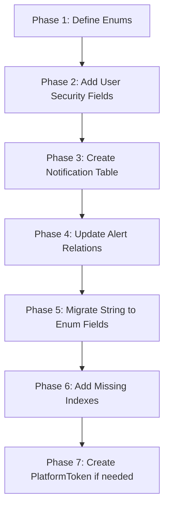

# 🔍 Database Deep Audit Report
> **Auditor:** Lead Database Auditor & Security Specialist  
> **Audit Date:** 2026-01-10  
> **Schema Version:** v1.2 (Sprint 3) → Target v2.0 (Sprint 4)  
> **Severity:** 🔴 **CRITICAL** - Immediate Action Required

---

## Executive Summary

| Category | Issues Found | Severity |
|----------|--------------|----------|
| Missing Tables | 2 | 🔴 Critical |
| Missing Security Fields | 9 | 🔴 Critical |
| Type Violations (String→Enum) | 11 | ⚠️ High |
| Missing Indexes | 3 | 🟡 Medium |
| Relationship Issues | 2 | 🟡 Medium |
| **Total Issues** | **27** | - |

---

## 1. 🛑 Critical Gaps (Missing Tables & Fields)

### 1.1 Table Existence Check

| Table | Wiki Requirement | Current Schema | Status | Priority |
|-------|------------------|----------------|--------|----------|
| `Notification` | ✅ Required | ❌ **MISSING** | 🔴 NOT FOUND | P0 |
| `PlatformToken` | ✅ Required | ❌ **MISSING** | 🔴 NOT FOUND | P0 |
| `User` | ✅ Exists | ✅ Exists | ⚠️ INCOMPLETE | P0 |
| `Session` | ✅ Exists | ✅ Exists | ⚠️ INCOMPLETE | P1 |
| `Tenant` | ✅ Exists | ✅ Exists | ⚠️ Missing Relations | P1 |

> [!CAUTION]
> **CRITICAL:** ไม่มี `Notification` table ในระบบเลย แต่ Wiki กำหนดให้ต้องมี 15+ fields สำหรับระบบแจ้งเตือน!

---

### 1.2 User Model - Security Fields Gap Analysis

| Field | Wiki Requirement | Current Schema | Status | Security Impact |
|-------|------------------|----------------|--------|-----------------|
| `lastLoginAt` | `DateTime?` | ❌ **MISSING** | 🔴 ABSENT | ไม่สามารถ Track Login Activity |
| `lastLoginIp` | `String?` | ❌ **MISSING** | 🔴 ABSENT | ไม่สามารถตรวจจับ Suspicious IP |
| `failedLoginCount` | `Int @default(0)` | ❌ **MISSING** | 🔴 ABSENT | ไม่มี Brute Force Protection |
| `lockedUntil` | `DateTime?` | ❌ **MISSING** | 🔴 ABSENT | ไม่สามารถ Lock Account |
| `passwordChangedAt` | `DateTime?` | ❌ **MISSING** | 🔴 ABSENT | ไม่มี Password Rotation Tracking |
| `twoFactorEnabled` | `Boolean @default(false)` | ❌ **MISSING** | 🔴 ABSENT | ไม่รองรับ 2FA |
| `notificationPreferences` | `Json?` | ❌ **MISSING** | 🟡 ABSENT | ไม่มี User Preferences |
| `timezone` | `String? @default("Asia/Bangkok")` | ❌ **MISSING** | 🟢 ABSENT | ใช้ Default ไปก่อนได้ |
| `language` | `String? @default("th")` | ❌ **MISSING** | 🟢 ABSENT | ใช้ Default ไปก่อนได้ |
| `notifications` | `Notification[]` relation | ❌ **MISSING** | 🔴 ABSENT | ไม่มี Notification Link |

**Security Risk Assessment:**
```
┌─────────────────────────────────────────────────────────────┐
│  🚨 SECURITY VULNERABILITY LEVEL: HIGH                     │
│                                                             │
│  • No Brute Force Protection (failedLoginCount missing)    │
│  • No Account Lockout Mechanism (lockedUntil missing)      │
│  • No Login Activity Monitoring (lastLoginAt/Ip missing)   │
│  • No Two-Factor Authentication Support                     │
│                                                             │
│  ⚠️ ระบบปัจจุบันไม่ผ่านมาตรฐาน Security Best Practice      │
└─────────────────────────────────────────────────────────────┘
```

---

### 1.3 Session Model - Missing Security Fields

| Field | Wiki Requirement | Current Schema | Status |
|-------|------------------|----------------|--------|
| `ipAddress` | Recommended | ❌ **MISSING** | 🟡 Should Add |
| `userAgent` | Recommended | ❌ **MISSING** | 🟡 Should Add |
| `deviceInfo` | Optional | ❌ **MISSING** | 🟢 Nice to Have |

**Current Session Model (Incomplete):**
```prisma
model Session {
  id           String   @id @default(cuid())
  userId       String
  refreshToken String   @unique
  expiresAt    DateTime
  createdAt    DateTime @default(now())
  // ❌ MISSING: ipAddress, userAgent
}
```

---

### 1.4 Tenant Model - Missing Relations

**Wiki ERD กำหนดให้ Tenant ต้องเชื่อมกับ:**
- ✅ `users` - มีแล้ว
- ✅ `campaigns` - มีแล้ว  
- ✅ `alertRules` - มีแล้ว
- ✅ `alerts` - มีแล้ว
- ❌ `notifications` - **MISSING**
- ❌ `platformTokens` - **MISSING**

---

## 2. ⚠️ Type Integrity Check (String → Enum Violations)

> [!WARNING]
> **พบ 11 จุด ที่ยังใช้ `String` แทนที่จะใช้ `Enum` ตาม Wiki มาตรฐาน**  
> การใช้ String ทำให้ไม่มี Type Safety และอาจเกิด Typo Bugs

### 2.1 Enum Definitions Missing

**Wiki กำหนด 6 Enums ที่ต้องมี แต่ Schema ไม่มีแม้แต่อันเดียว:**

| Enum | Status | Affected Models |
|------|--------|-----------------|
| `UserRole` | ❌ NOT DEFINED | `User.role` |
| `CampaignStatus` | ❌ NOT DEFINED | `Campaign.status` |
| `AdPlatform` | ❌ NOT DEFINED | `Campaign.platform`, `SyncLog.platform`, `APIConnection.platform` |
| `NotificationChannel` | ❌ NOT DEFINED | Future `Notification.channel` |
| `AlertSeverity` | ❌ NOT DEFINED | `Alert.severity`, `AlertRule.severity` |
| `SyncStatus` | ❌ NOT DEFINED | `SyncLog.status`, `Campaign.syncStatus` |

---

### 2.2 Field-by-Field Type Violation Report

| # | Model | Field | Current Type | Wiki Target | Line # | Action Required |
|---|-------|-------|--------------|-------------|--------|-----------------|
| 1 | `User` | `role` | `String` | `UserRole` | L37 | 🔴 MUST FIX |
| 2 | `Campaign` | `status` | `String` | `CampaignStatus` | L62 | 🔴 MUST FIX |
| 3 | `Campaign` | `platform` | `String` | `AdPlatform` | L61 | 🔴 MUST FIX |
| 4 | `Campaign` | `syncStatus` | `String?` | `SyncStatus` | L72 | ⚠️ SHOULD FIX |
| 5 | `SyncLog` | `platform` | `String` | `AdPlatform` | L314 | 🔴 MUST FIX |
| 6 | `SyncLog` | `status` | `String` | `SyncStatus` | L317 | 🔴 MUST FIX |
| 7 | `SyncLog` | `syncType` | `String?` | (Custom Enum) | L316 | ⚠️ SHOULD FIX |
| 8 | `Alert` | `severity` | `String` | `AlertSeverity` | L289 | 🔴 MUST FIX |
| 9 | `Alert` | `status` | `String` | (Custom Enum) | L293 | ⚠️ SHOULD FIX |
| 10 | `AlertRule` | `severity` | `String` | `AlertSeverity` | L269 | 🔴 MUST FIX |
| 11 | `AlertRule` | `type` | `String` | (Custom Enum) | L265 | ⚠️ SHOULD FIX |

**Violation Count by Priority:**
- 🔴 MUST FIX: **7 violations**
- ⚠️ SHOULD FIX: **4 violations**

---

## 3. 🔗 Relationship & Constraint Analysis

### 3.1 Missing Foreign Key Relationships

| Relationship | Wiki ERD | Current Schema | Status |
|--------------|----------|----------------|--------|
| `Alert` → `Notification` | `Alert ||--o{ Notification` | ❌ **MISSING** | 🔴 NO LINK |
| `Tenant` → `Notification` | `Tenant ||--o{ Notification` | ❌ **MISSING** | 🔴 NO LINK |
| `User` → `Notification` | `User ||--o{ Notification` | ❌ **MISSING** | 🔴 NO LINK |
| `Tenant` → `PlatformToken` | Required | ❌ **MISSING** | 🔴 NO LINK |

### 3.2 onDelete Configuration Issues

**⚠️ ไม่มีการกำหนด `onDelete` behavior ใน relationships:**

| Relation | Current | Recommended | Risk |
|----------|---------|-------------|------|
| `User` → `Tenant` | No cascade | `onDelete: Cascade` or `SetNull` | Orphan records |
| `Campaign` → `Tenant` | No cascade | `onDelete: Cascade` | Orphan campaigns |
| `Alert` → `Campaign` | No cascade | `onDelete: SetNull` | Alert reference errors |
| `Session` → `User` | No cascade | `onDelete: Cascade` | Orphan sessions |

---

### 3.3 Missing Indexes for Dashboard Performance

**Wiki กำหนด Index สำหรับ Notification ที่จะสร้างใหม่:**

| Model | Required Index | Purpose | Status |
|-------|----------------|---------|--------|
| `Notification` | `@@index([userId, isRead])` | Unread notifications query | ❌ Table missing |
| `Notification` | `@@index([tenantId])` | Tenant filter | ❌ Table missing |
| `Notification` | `@@index([createdAt])` | Sort by date | ❌ Table missing |
| `Notification` | `@@index([type])` | Filter by type | ❌ Table missing |

**เพิ่มเติม: Index ที่ควรมีใน Models ปัจจุบัน:**

| Model | Suggested Index | Purpose | Status |
|-------|-----------------|---------|--------|
| `Campaign` | `@@index([tenantId, createdAt])` | Dashboard date filter | ❌ MISSING |
| `Metric` | `@@index([campaignId, date])` | Exists ✅ | OK |
| `Alert` | `@@index([tenantId, status, createdAt])` | Dashboard alert list | ❌ MISSING |
| `User` | `@@index([tenantId, isActive])` | Active users query | ❌ MISSING |

---

## 4. 🛠️ Remediation Code Snippets

### 4.1 Complete Enum Definitions (Add to top of schema.prisma)

```prisma
// ============================================
// ENUMS - Sprint 4 Type Safety
// ============================================

enum UserRole {
  ADMIN
  MANAGER
  CLIENT
  VIEWER
}

enum CampaignStatus {
  ACTIVE
  PAUSED
  DELETED
  PENDING
  COMPLETED
}

enum AdPlatform {
  GOOGLE_ADS
  FACEBOOK
  TIKTOK
  LINE_ADS
  GOOGLE_ANALYTICS
}

enum NotificationChannel {
  IN_APP
  EMAIL
  LINE
  SMS
}

enum AlertSeverity {
  INFO
  WARNING
  CRITICAL
}

enum SyncStatus {
  PENDING
  STARTED
  IN_PROGRESS
  SUCCESS
  COMPLETED
  FAILED
}

enum AlertStatus {
  OPEN
  ACKNOWLEDGED
  RESOLVED
}

enum SyncType {
  INITIAL
  SCHEDULED
  MANUAL
}

enum AlertRuleType {
  PRESET
  CUSTOM
}
```

---

### 4.2 Corrected User Model (Full Version)

```prisma
model User {
  id                      String    @id @default(cuid())
  email                   String    @unique
  password                String
  name                    String?
  role                    UserRole  @default(CLIENT)  // ✅ Changed from String
  isActive                Boolean   @default(true)
  tenantId                String
  createdAt               DateTime  @default(now())
  updatedAt               DateTime  @updatedAt

  // 🔐 Security Enhancement (Sprint 4)
  lastLoginAt             DateTime?
  lastLoginIp             String?
  failedLoginCount        Int       @default(0)
  lockedUntil             DateTime?
  passwordChangedAt       DateTime?
  twoFactorEnabled        Boolean   @default(false)

  // 🔔 Notification Preferences
  notificationPreferences Json?     // { "email": true, "inApp": true, "line": false }

  // 📱 UI Preferences
  timezone                String?   @default("Asia/Bangkok")
  language                String?   @default("th")

  // Relations
  sessions                Session[]
  tenant                  Tenant    @relation(fields: [tenantId], references: [id])
  notifications           Notification[]

  @@index([role])
  @@index([isActive])
  @@index([tenantId, isActive])  // ✅ New composite index
  @@index([email])               // ✅ New for login lookup
}
```

---

### 4.3 Complete Notification Model (As per Wiki Spec)

```prisma
// ============================================
// Notification System - Sprint 4
// ============================================

model Notification {
  id          String              @id @default(cuid())
  tenantId    String
  userId      String

  // Content
  type        String              // ALERT, REPORT_READY, SYNC_COMPLETE, SYSTEM, CAMPAIGN_UPDATE
  title       String              // "Campaign Budget Alert"
  message     String              @db.Text  // Support long messages

  // Channel & Delivery
  channel     NotificationChannel @default(IN_APP)
  priority    String              @default("NORMAL")  // LOW, NORMAL, HIGH, URGENT

  // 📦 Metadata for Frontend Actions (JSONB)
  // Structure: { "actionUrl": "/campaigns/123", "actionText": "View", "icon": "alert-circle" }
  metadata    Json?               @db.JsonB

  // Status
  isRead      Boolean             @default(false)
  readAt      DateTime?
  isDismissed Boolean             @default(false)

  // Reference Links
  alertId     String?             // Link to Alert if notification from alert
  campaignId  String?             // Related campaign (optional)

  // Timestamps
  scheduledAt DateTime?           // For scheduled notifications
  sentAt      DateTime?
  createdAt   DateTime            @default(now())
  expiresAt   DateTime?           // Auto-dismiss after this time

  // Relations with proper cascade
  tenant      Tenant              @relation(fields: [tenantId], references: [id], onDelete: Cascade)
  user        User                @relation(fields: [userId], references: [id], onDelete: Cascade)
  alert       Alert?              @relation(fields: [alertId], references: [id], onDelete: SetNull)

  @@index([userId, isRead])       // For "unread" badge query
  @@index([tenantId])             // Tenant isolation
  @@index([createdAt])            // Sort by newest
  @@index([type])                 // Filter by notification type
  @@index([userId, createdAt])    // User's notification timeline
}
```

---

### 4.4 Updated Alert Model (Add Notification Relation)

```prisma
model Alert {
  id            String         @id @default(cuid())
  tenantId      String
  ruleId        String?
  campaignId    String?
  type          String         // LOW_ROAS, OVERSPEND, CUSTOM, etc.
  severity      AlertSeverity  // ✅ Changed from String
  title         String
  message       String
  metadata      Json?          // ✅ Changed from String to Json
  status        AlertStatus    @default(OPEN)  // ✅ Changed from String
  createdAt     DateTime       @default(now())
  resolvedAt    DateTime?

  // Relations
  tenant        Tenant         @relation(fields: [tenantId], references: [id])
  rule          AlertRule?     @relation(fields: [ruleId], references: [id])
  campaign      Campaign?      @relation(fields: [campaignId], references: [id])
  notifications Notification[] // ✅ NEW: Link to notifications

  @@index([tenantId])
  @@index([status])
  @@index([severity])
  @@index([createdAt])
  @@index([tenantId, status, createdAt])  // ✅ New composite index
}
```

---

### 4.5 Updated Campaign Model (Enum Conversion)

```prisma
model Campaign {
  id                   String            @id @default(cuid())
  name                 String
  platform             AdPlatform        // ✅ Changed from String
  status               CampaignStatus    // ✅ Changed from String
  budget               Float?
  startDate            DateTime?
  endDate              DateTime?
  externalId           String?
  googleAdsAccountId   String?
  facebookAdsAccountId String?
  tiktokAdsAccountId   String?
  lineAdsAccountId     String?
  lastSyncedAt         DateTime?
  syncStatus           SyncStatus?       @default(PENDING)  // ✅ Changed from String
  tenantId             String
  createdAt            DateTime          @default(now())
  updatedAt            DateTime          @updatedAt

  // Relations
  lineAdsAccount       LineAdsAccount?   @relation(fields: [lineAdsAccountId], references: [id])
  tiktokAdsAccount     TikTokAdsAccount? @relation(fields: [tiktokAdsAccountId], references: [id])
  facebookAdsAccount   FacebookAdsAccount? @relation(fields: [facebookAdsAccountId], references: [id])
  googleAdsAccount     GoogleAdsAccount? @relation(fields: [googleAdsAccountId], references: [id])
  tenant               Tenant            @relation(fields: [tenantId], references: [id])
  metrics              Metric[]
  alerts               Alert[]

  @@unique([tenantId, externalId])
  @@index([googleAdsAccountId])
  @@index([platform])
  @@index([status])
  @@index([tenantId, status])
  @@index([tenantId, createdAt])  // ✅ New for dashboard filter
}
```

---

### 4.6 Updated SyncLog Model (Enum Conversion)

```prisma
model SyncLog {
  id           String     @id @default(cuid())
  tenantId     String
  platform     AdPlatform // ✅ Changed from String
  accountId    String?
  syncType     SyncType?  // ✅ Changed from String
  status       SyncStatus @default(PENDING) // ✅ Changed from String
  startedAt    DateTime   @default(now())
  completedAt  DateTime?
  errorMessage String?
  recordsCount Int?
  recordsSync  Int        @default(0)
  createdAt    DateTime   @default(now())

  tenant       Tenant     @relation(fields: [tenantId], references: [id])

  @@index([tenantId])
  @@index([platform])
  @@index([status])
  @@index([createdAt])
  @@index([accountId])
}
```

---

### 4.7 Updated Tenant Model (Add New Relations)

```prisma
model Tenant {
  id                      String                   @id @default(cuid())
  name                    String
  settings                Json?                    // ✅ Changed from String to Json
  createdAt               DateTime                 @default(now())
  updatedAt               DateTime                 @updatedAt

  // Existing Relations
  apiConnections          APIConnection[]
  campaigns               Campaign[]
  facebookAdsAccounts     FacebookAdsAccount[]     @relation("FacebookAdsAccounts")
  googleAdsAccounts       GoogleAdsAccount[]       @relation("GoogleAdsAccounts")
  googleAnalyticsAccounts GoogleAnalyticsAccount[] @relation("GoogleAnalyticsAccounts")
  lineAdsAccounts         LineAdsAccount[]         @relation("LineAdsAccounts")
  tiktokAdsAccounts       TikTokAdsAccount[]       @relation("TikTokAdsAccounts")
  users                   User[]
  alertRules              AlertRule[]
  alerts                  Alert[]
  syncLogs                SyncLog[]

  // ✅ NEW Relations for Sprint 4
  notifications           Notification[]
  platformTokens          PlatformToken[]
}
```

---

## 5. 📋 Migration Action Plan

### Priority Order (Recommended)



### Migration Checklist

```markdown
## Phase 1: Enum Definitions
- [ ] Add UserRole enum
- [ ] Add CampaignStatus enum
- [ ] Add AdPlatform enum
- [ ] Add NotificationChannel enum
- [ ] Add AlertSeverity enum
- [ ] Add SyncStatus enum
- [ ] Add AlertStatus enum

## Phase 2: User Security
- [ ] Add lastLoginAt to User
- [ ] Add lastLoginIp to User
- [ ] Add failedLoginCount to User
- [ ] Add lockedUntil to User
- [ ] Add passwordChangedAt to User
- [ ] Add twoFactorEnabled to User
- [ ] Add notificationPreferences to User
- [ ] Add timezone to User
- [ ] Add language to User

## Phase 3: Notification System
- [ ] Create Notification table
- [ ] Add notifications relation to Tenant
- [ ] Add notifications relation to User
- [ ] Add notifications relation to Alert

## Phase 4: Type Migration (String → Enum)
- [ ] Migrate User.role → UserRole
- [ ] Migrate Campaign.status → CampaignStatus
- [ ] Migrate Campaign.platform → AdPlatform
- [ ] Migrate Alert.severity → AlertSeverity
- [ ] Migrate AlertRule.severity → AlertSeverity
- [ ] Migrate SyncLog.platform → AdPlatform
- [ ] Migrate SyncLog.status → SyncStatus

## Phase 5: Indexing
- [ ] Add @@index([tenantId, isActive]) to User
- [ ] Add @@index([tenantId, createdAt]) to Campaign
- [ ] Add @@index([tenantId, status, createdAt]) to Alert
- [ ] Add all required indexes to Notification
```

---

## Appendix: Full Diff Summary

```diff
// schema.prisma changes required

+ enum UserRole { ADMIN, MANAGER, CLIENT, VIEWER }
+ enum CampaignStatus { ACTIVE, PAUSED, DELETED, PENDING, COMPLETED }
+ enum AdPlatform { GOOGLE_ADS, FACEBOOK, TIKTOK, LINE_ADS, GOOGLE_ANALYTICS }
+ enum NotificationChannel { IN_APP, EMAIL, LINE, SMS }
+ enum AlertSeverity { INFO, WARNING, CRITICAL }
+ enum SyncStatus { PENDING, STARTED, IN_PROGRESS, SUCCESS, COMPLETED, FAILED }

  model User {
-   role      String    @default("CLIENT")
+   role      UserRole  @default(CLIENT)
+   lastLoginAt DateTime?
+   lastLoginIp String?
+   failedLoginCount Int @default(0)
+   lockedUntil DateTime?
+   passwordChangedAt DateTime?
+   twoFactorEnabled Boolean @default(false)
+   notificationPreferences Json?
+   notifications Notification[]
  }

  model Campaign {
-   platform String
+   platform AdPlatform
-   status   String
+   status   CampaignStatus
  }

  model Alert {
-   severity String
+   severity AlertSeverity
+   notifications Notification[]
  }

+ model Notification { ... }  // 20+ fields
```

---

> **Audit Conclusion:**  
> Schema ปัจจุบัน **ไม่ผ่านมาตรฐาน Sprint 4** ต้องดำเนินการแก้ไข **27 จุด** ก่อน Production  
> ระดับความเร่งด่วน: 🔴 **CRITICAL**

---

**Signed off by:**  
Lead Database Auditor & Security Specialist  
Date: 2026-01-10
