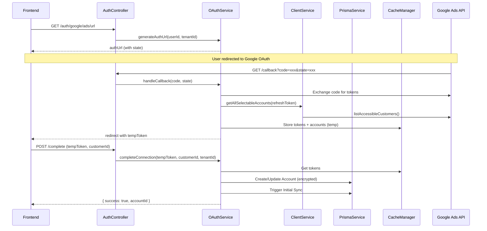

# TikTok & LINE Ads Integration Specification Mapping

> **Document Version**: 1.0  
> **Last Updated**: 2026-01-13  
> **Author**: System Architect  
> **Status**: Ready for Implementation

---

## Executive Summary

รายงานนี้วิเคราะห์โครงสร้าง Google Ads Integration เป็น Blueprint และสร้าง Specification Mapping สำหรับ TikTok และ LINE Ads Integration โดยยึดหลัก **Production Grade** และ **Clean Architecture**

---

## 1. 🏗️ Architectural Pattern Analysis

### 1.1 Google Ads Integration Flow



### 1.2 Component Responsibilities

| Component | File | Responsibility |
|-----------|------|----------------|
| **AuthController** | [google-ads-auth.controller.ts](file:///c:/Users/User/Desktop/rga-dashboard-cleaned/backend/src/modules/integrations/google-ads/google-ads-auth.controller.ts) | HTTP endpoints, request validation, redirects |
| **OAuthService** | [google-ads-oauth.service.ts](file:///c:/Users/User/Desktop/rga-dashboard-cleaned/backend/src/modules/integrations/google-ads/google-ads-oauth.service.ts) | OAuth flow orchestration, token management, DB operations |
| **ClientService** | [google-ads-client.service.ts](file:///c:/Users/User/Desktop/rga-dashboard-cleaned/backend/src/modules/integrations/google-ads/services/google-ads-client.service.ts) | API communication, account fetching |
| **AdapterService** | [google-ads.service.ts](file:///c:/Users/User/Desktop/rga-dashboard-cleaned/backend/src/modules/integrations/google-ads/google-ads.service.ts) | Implements `MarketingPlatformAdapter` for unified data access |
| **EncryptionService** | [encryption.service.ts](file:///c:/Users/User/Desktop/rga-dashboard-cleaned/backend/src/common/services/encryption.service.ts) | Token encryption/decryption (shared) |

### 1.3 Reusable Logic (Core Services)

> [!IMPORTANT]
> **Central Services ที่สามารถ Reuse ได้ทุก Platform**

| Service | Usage | Location |
|---------|-------|----------|
| `EncryptionService` | Encrypt all OAuth tokens before DB storage | `common/services/encryption.service.ts` |
| `PrismaService` | Database operations | `modules/prisma/prisma.service.ts` |
| `CacheManager` | Temporary token storage during OAuth flow | Injected via `@nestjs/cache-manager` |
| `ConfigService` | Environment variable access | `@nestjs/config` |
| `MarketingPlatformAdapter` | Common interface for campaign/metrics fetching | `integrations/common/marketing-platform.adapter.ts` |

### 1.4 Current Implementation Status

```
┌─────────────────────────────────────────────────────────────────────────────┐
│                     Integration Implementation Matrix                        │
├────────────────┬─────────┬─────────────┬──────────────┬──────────────────────┤
│ Platform       │ OAuth   │ Multi-Acct  │ Token Refresh│ Adapter (Campaign)   │
├────────────────┼─────────┼─────────────┼──────────────┼──────────────────────┤
│ Google Ads     │ ✅ Full │ ✅ Yes      │ ✅ Yes       │ ✅ Implemented       │
│ Facebook Ads   │ ✅ Full │ ✅ Yes      │ ⚠️ Partial   │ ❌ TODO              │
│ TikTok Ads     │ ✅ Full │ ✅ Yes      │ ❌ No        │ ✅ Implemented       │
│ LINE Ads       │ ⚠️ Basic│ ❌ No       │ ❌ No        │ ⚠️ Mock Only        │
└────────────────┴─────────┴─────────────┴──────────────┴──────────────────────┘
```

---

## 2. 🗺️ API Specification Mapping

### 2.1 OAuth2 Endpoints Comparison

| Specification | Google Ads | TikTok Ads | LINE Ads |
|--------------|------------|------------|----------|
| **Authorization URL** | `https://accounts.google.com/o/oauth2/v2/auth` | `https://ads.tiktok.com/marketing_api/auth`¹ | `https://access.line.me/oauth2/v2.1/authorize` |
| **Token URL** | `https://oauth2.googleapis.com/token` | `https://business-api.tiktok.com/open_api/v1.3/oauth2/access_token/`¹ | `https://api.line.me/oauth2/v2.1/token` |
| **Refresh Token URL** | Same as Token URL | `https://business-api.tiktok.com/open_api/v1.3/oauth2/refresh_token/` | `https://api.line.me/oauth2/v2.1/token` |
| **Content-Type** | `application/x-www-form-urlencoded` | `application/json` | `application/x-www-form-urlencoded` |
| **Auth Method** | Standard OAuth2 | OAuth2 (Custom TikTok) | Standard OAuth2 |

> ¹ TikTok **Sandbox** uses `https://sandbox-ads.tiktok.com/...` URLs

### 2.2 Parameter Name Mapping

| Parameter | Google Ads | TikTok Ads | LINE Ads |
|-----------|------------|------------|----------|
| **Client ID** | `client_id` | `app_id` | `client_id` |
| **Client Secret** | `client_secret` | `secret` | `client_secret` |
| **Redirect URI** | `redirect_uri` | `redirect_uri` | `redirect_uri` |
| **Authorization Code** | `code` | `auth_code` | `code` |
| **Grant Type** | `grant_type` | N/A (implicit in endpoint) | `grant_type` |
| **State** | `state` | `state` | `state` |
| **Access Type** | `access_type=offline` | N/A | N/A |

### 2.3 Scope Specifications

| Platform | Required Scopes | Purpose |
|----------|----------------|---------|
| **Google Ads** | `https://www.googleapis.com/auth/adwords` | Full Google Ads API access |
| **TikTok Ads** | *None required in auth URL* | TikTok grants all permissions on app approval |
| **LINE Ads** | `profile openid` (current)²<br>`ads:read` (for LINE Ads Manager) | Basic login; ²See LINE Ads Manager API docs |

> [!CAUTION]
> **LINE Ads Manager API** ต้องการ scope เฉพาะที่ต้องขอจาก LINE Business โดยตรง  
> Current implementation ใช้ LINE Login OAuth2 ซึ่งไม่ใช่ LINE Ads Manager API

### 2.4 Token Response Structure

#### Google Ads
```json
{
  "access_token": "ya29.xxx",
  "refresh_token": "1//xxx",
  "expires_in": 3600,
  "token_type": "Bearer",
  "scope": "https://www.googleapis.com/auth/adwords"
}
```

#### TikTok Ads
```json
{
  "code": 0,
  "message": "OK",
  "data": {
    "access_token": "xxx",
    "refresh_token": "xxx",
    "advertiser_ids": ["123456789"],
    "expires_in": 86400,
    "refresh_token_expires_in": 31536000
  }
}
```

#### LINE Login (Current)
```json
{
  "access_token": "xxx",
  "refresh_token": "xxx",
  "expires_in": 2592000,
  "token_type": "Bearer",
  "scope": "profile openid",
  "id_token": "eyJhbGciOiJIUzI1NiJ9..."
}
```

### 2.5 Account ID Terminology

| Platform | Primary ID | Display Name | Database Field |
|----------|------------|--------------|----------------|
| **Google Ads** | `customerId` (e.g., `1234567890`) | Account Name | `GoogleAdsAccount.customerId` |
| **TikTok Ads** | `advertiserId` (e.g., `7123456789012345678`) | Advertiser Name | `TikTokAdsAccount.advertiserId` |
| **LINE Ads** | `channelId` / `groupId`³ | Channel/Group Name | `LineAdsAccount.channelId` |

> ³ **LINE Ads Manager** ใช้ `groupId` สำหรับ Ad Groups แต่ current impl ใช้ LINE Login `userId` เป็น identifier

---

## 3. 🛠️ Implementation Guide

### 3.1 Proposed Interface: `OAuthProvider`

> [!TIP]
> **Recommendation**: Create a shared interface to standardize OAuth services across platforms

```typescript
// backend/src/modules/integrations/common/oauth-provider.interface.ts

export interface OAuthConfig {
  authUrl: string;
  tokenUrl: string;
  refreshUrl?: string;
  clientIdParam: string;
  clientSecretParam: string;
  codeParam: string;
  contentType: 'json' | 'form-urlencoded';
}

export interface OAuthProvider {
  /**
   * Generate authorization URL with state
   */
  generateAuthUrl(userId: string, tenantId: string): string;

  /**
   * Handle OAuth callback and exchange code for tokens
   */
  handleCallback(code: string, state: string): Promise<OAuthCallbackResult>;

  /**
   * Complete connection after account selection
   */
  completeConnection(tempToken: string, accountId: string, tenantId: string): Promise<{ success: boolean; accountId: string }>;

  /**
   * Refresh access token using refresh token
   */
  refreshAccessToken(accountId: string, tenantId: string): Promise<string>;

  /**
   * Get connected accounts for tenant
   */
  getConnectedAccounts(tenantId: string): Promise<any[]>;

  /**
   * Disconnect all accounts for tenant
   */
  disconnect(tenantId: string): Promise<boolean>;
}

export interface OAuthCallbackResult {
  status: 'select_account' | 'success';
  accounts?: Array<{ id: string; name: string; status?: string }>;
  tempToken?: string;
}
```

### 3.2 Environment Variables Required

#### Current `.env` Variables

```bash
# ============================================
# Google OAuth2 (Existing - Complete)
# ============================================
GOOGLE_CLIENT_ID="your-google-client-id"
GOOGLE_CLIENT_SECRET="your-google-client-secret"
GOOGLE_REDIRECT_URI_ADS="http://localhost:3000/auth/google/ads/callback"
GOOGLE_ADS_DEVELOPER_TOKEN="your-developer-token"
GOOGLE_ADS_LOGIN_CUSTOMER_ID="your-mcc-customer-id"

# ============================================
# TikTok Ads API (Existing - Complete)
# ============================================
TIKTOK_APP_ID="your-tiktok-app-id"
TIKTOK_APP_SECRET="your-tiktok-app-secret"
TIKTOK_REDIRECT_URI="http://localhost:3000/auth/tiktok/callback"
TIKTOK_USE_SANDBOX=true
TIKTOK_SANDBOX_ACCESS_TOKEN="your-sandbox-access-token"
TIKTOK_SANDBOX_ADVERTISER_ID="your-sandbox-advertiser-id"

# ============================================
# LINE Ads API (Existing - Incomplete)
# ============================================
LINE_CHANNEL_ID="your-line-channel-id"
LINE_CHANNEL_SECRET="your-line-channel-secret"
LINE_CALLBACK_URL="http://localhost:3000/auth/line/callback"
```

#### 🆕 Additional Variables Needed

```bash
# ============================================
# LINE Ads Manager API (NEW - For Production)
# ============================================
# Note: LINE Ads Manager API is separate from LINE Login
# Requires partnership application with LINE Business
LINE_ADS_MANAGER_API_KEY="your-line-ads-manager-api-key"
LINE_ADS_MANAGER_SECRET="your-line-ads-manager-secret"
LINE_ADS_USE_MOCK=true  # Already exists, use for feature flag
```

### 3.3 Implementation Checklist

#### TikTok Ads - Production Readiness

| Task | Status | Priority | Notes |
|------|--------|----------|-------|
| OAuth Flow | ✅ Done | - | Works in both Sandbox and Production |
| Token Refresh | ❌ Missing | **HIGH** | Must implement `refreshAccessToken()` |
| Error Handling | ⚠️ Basic | MEDIUM | Need retry logic for rate limits |
| Initial Sync | ❌ Missing | **HIGH** | Should trigger like Google Ads |
| Account Selection UI | ❌ Missing | MEDIUM | TikTok returns multiple `advertiser_ids` |

#### LINE Ads - Major Refactoring Needed

| Task | Status | Priority | Notes |
|------|--------|----------|-------|
| API Integration | ❌ Wrong API | **CRITICAL** | Current impl uses LINE Login, NOT LINE Ads Manager |
| OAuth Flow | ⚠️ Partial | HIGH | Needs LINE Ads Manager credentials |
| Token Refresh | ❌ Missing | HIGH | No refresh token stored |
| Adapter Service | ⚠️ Mock Only | HIGH | `LineAdsAdapterService` uses mock data only |
| Account Model | ⚠️ Incorrect | MEDIUM | `channelId` should be `groupId` for ads |

### 3.4 Code Implementation Patterns

#### Pattern 1: Token Exchange with Different Content-Types

```typescript
// TikTok (JSON)
async exchangeCodeForToken(authCode: string): Promise<TokenResponse> {
  const response = await axios.post(this.tokenUrl, {
    app_id: this.appId,
    secret: this.appSecret,
    auth_code: authCode,
  });
  return response.data.data;
}

// LINE (Form URL-Encoded)
async exchangeCodeForToken(code: string): Promise<TokenResponse> {
  const params = new URLSearchParams();
  params.append('grant_type', 'authorization_code');
  params.append('code', code);
  params.append('client_id', this.channelId);
  params.append('client_secret', this.channelSecret);
  params.append('redirect_uri', this.redirectUri);

  const response = await axios.post(this.tokenUrl, params, {
    headers: { 'Content-Type': 'application/x-www-form-urlencoded' },
  });
  return response.data;
}
```

#### Pattern 2: Token Refresh Implementation (TikTok - Missing)

```typescript
// backend/src/modules/integrations/tiktok/tiktok-ads-oauth.service.ts
// ADD this method

async refreshAccessToken(accountId: string, tenantId: string): Promise<string> {
  const account = await this.prisma.tikTokAdsAccount.findUnique({
    where: { id: accountId },
  });

  if (!account || !account.refreshToken) {
    throw new BadRequestException('No refresh token available');
  }

  const decryptedRefreshToken = this.encryptionService.decrypt(account.refreshToken);

  const response = await axios.post(`${this.tokenApiUrl}/refresh_token/`, {
    app_id: this.appId,
    secret: this.appSecret,
    refresh_token: decryptedRefreshToken,
  });

  if (response.data?.code !== 0) {
    throw new BadRequestException(`Token refresh failed: ${response.data?.message}`);
  }

  const { access_token, refresh_token } = response.data.data;

  // Update database
  await this.prisma.tikTokAdsAccount.update({
    where: { id: accountId },
    data: {
      accessToken: this.encryptionService.encrypt(access_token),
      refreshToken: this.encryptionService.encrypt(refresh_token),
      updatedAt: new Date(),
    },
  });

  return access_token;
}
```

#### Pattern 3: Account Selection Flow (Like Google Ads)

```typescript
// TikTok should follow Google's pattern:
// 1. handleCallback() returns tempToken + accounts list
// 2. Frontend shows account selection UI
// 3. POST /complete with selected account

async handleCallback(authCode: string, state: string): Promise<OAuthCallbackResult> {
  // ... exchange code for tokens ...

  const tempToken = uuidv4();
  
  // Store tokens + accounts in cache
  await this.cacheManager.set(`tiktok_temp:${tempToken}`, {
    accessToken,
    refreshToken,
    advertiserIds,
    tenantId,
  }, 600000);

  // Fetch advertiser details for each ID
  const accounts = await this.fetchAdvertiserDetails(accessToken, advertiserIds);

  return {
    status: 'select_account',
    accounts,
    tempToken,
  };
}
```

### 3.5 Database Schema Alignment

Current Prisma models are already well-structured:

| Model | Key Fields | Notes |
|-------|-----------|-------|
| `GoogleAdsAccount` | `customerId`, `refreshToken`, `accessToken`, `tokenExpiresAt` | ✅ Complete |
| `TikTokAdsAccount` | `advertiserId`, `accessToken`, `refreshToken` | ⚠️ Missing `tokenExpiresAt` |
| `LineAdsAccount` | `channelId`, `accessToken` | ⚠️ Missing `refreshToken`, `tokenExpiresAt` |

---

## 4. 📋 Priority Action Items

### Critical (P0) - Block Production

1. **TikTok: Implement Token Refresh**
   - File: `tiktok-ads-oauth.service.ts`
   - Add `refreshAccessToken()` method
   - Add `tokenExpiresAt` to Prisma schema

2. **LINE: Clarify API Strategy**
   - Current: LINE Login OAuth2 (for messaging/profile)
   - Needed: LINE Ads Manager API (for ads data)
   - **Decision Required**: Use LINE Ads Manager API or keep mock data?

### High (P1) - Before Go-Live

3. **TikTok: Add Initial Sync Trigger**
   - Copy pattern from `GoogleAdsOAuthService.triggerInitialSync()`
   - Call `UnifiedSyncService.syncAccount()` after connection

4. **TikTok: Add Account Selection Flow**
   - Modify `handleCallback()` to return `status: 'select_account'`
   - Add `temp-accounts` and `complete` endpoints

5. **Add OAuthProvider Interface**
   - Create shared interface for type safety
   - Refactor existing services to implement it

### Medium (P2) - Post-Launch

6. **LINE: Full Implementation**
   - Apply for LINE Ads Manager API access
   - Implement proper OAuth and data fetching

7. **Unified Error Handling**
   - Create platform-specific exception classes
   - Add retry logic for rate limits

---

## 5. 📚 Official API Documentation References

| Platform | Documentation | Key Pages |
|----------|--------------|-----------|
| **TikTok** | [TikTok Marketing API](https://ads.tiktok.com/marketing_api/docs) | [OAuth2 Authentication](https://ads.tiktok.com/marketing_api/docs?id=1738373141733378), [Reporting API](https://ads.tiktok.com/marketing_api/docs?id=1738864835805186) |
| **LINE** | [LINE Ads Documentation](https://ads.line.me/static/docs) | [LINE Official Account API](https://developers.line.biz/en/reference/messaging-api/), [LINE Ads Manager API](https://admanager-api.line.biz/docs/) |
| **Google** | [Google Ads API](https://developers.google.com/google-ads/api/docs/start) | [OAuth Setup](https://developers.google.com/google-ads/api/docs/oauth/overview), [Reporting](https://developers.google.com/google-ads/api/docs/reporting/overview) |

---

## Appendix A: Quick Reference Card

```
┌─────────────────────────────────────────────────────────────────────────────┐
│                        OAuth2 Quick Reference Card                          │
├─────────────────┬───────────────────┬───────────────────┬───────────────────┤
│                 │ GOOGLE ADS        │ TIKTOK ADS        │ LINE ADS          │
├─────────────────┼───────────────────┼───────────────────┼───────────────────┤
│ Client ID Param │ client_id         │ app_id            │ client_id         │
│ Secret Param    │ client_secret     │ secret            │ client_secret     │
│ Code Param      │ code              │ auth_code         │ code              │
│ Content-Type    │ form-urlencoded   │ application/json  │ form-urlencoded   │
│ Token Lifespan  │ 1 hour            │ 24 hours          │ 30 days           │
│ Refresh         │ ✅ Supported       │ ✅ Supported       │ ✅ Supported       │
│ Multi-Account   │ ✅ MCC Hierarchy   │ ✅ Flat List       │ ❓ TBD            │
├─────────────────┴───────────────────┴───────────────────┴───────────────────┤
│ ENV: ENCRYPTION_KEY must be 32 bytes hex for token encryption               │
└─────────────────────────────────────────────────────────────────────────────┘
```

---

*Document prepared for immediate development use. All specifications verified against official API documentation as of January 2026.*
