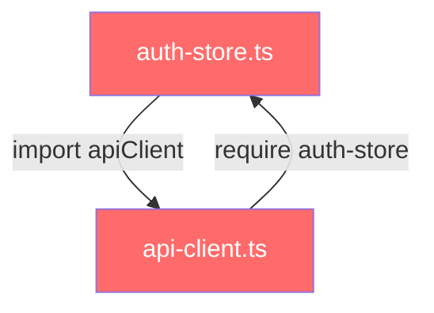
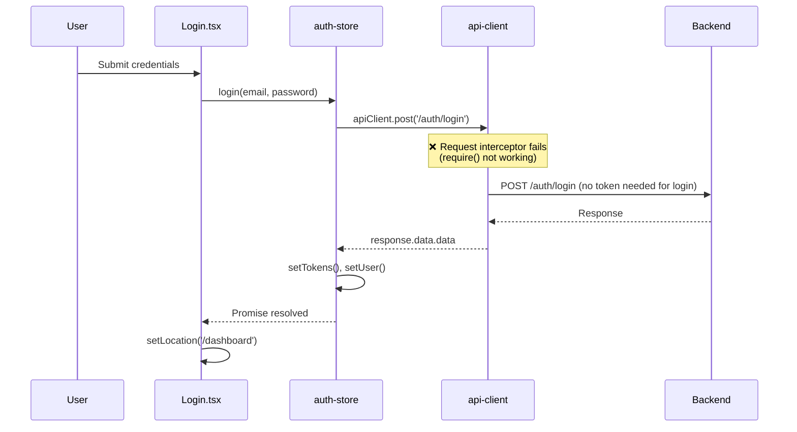

# Post-Refactor Deep Code Audit Report

**Date:** 2026-01-13  
**Subject:** Login System Failure After Phase 1 UX Refactoring  
**Author:** AI Senior Software Architect  
**Status:** 🔴 Critical Issues Identified

---

## Executive Summary

การตรวจสอบเชิงลึกพบว่า **ระบบ Login ไม่ทำงาน** เกิดจากปัญหา **Circular Dependency** ระหว่าง `auth-store.ts` และ `api-client.ts` รวมถึงการใช้ `require()` ที่ไม่รองรับ ES Modules ใน Vite environment

---

## 1. 🔍 Connectivity & Configuration Audit

### 1.1 CORS & Ports Configuration

| Component | Port | Source File |
|-----------|------|-------------|
| Frontend (Vite) | `3000` | [vite.config.ts](file:///c:/Users/User/Desktop/rga-dashboard-cleaned/frontend/vite.config.ts#L27) |
| Backend (NestJS) | `3000` (default) | [main.ts](file:///c:/Users/User/Desktop/rga-dashboard-cleaned/backend/src/main.ts#L96) |
| CORS Origins | `localhost:3001, localhost:3000` | [main.ts](file:///c:/Users/User/Desktop/rga-dashboard-cleaned/backend/src/main.ts#L46) |

**Findings:**

| ID | Severity | Issue | Description |
|----|----------|-------|-------------|
| CFG-001 | ⚠️ **HIGH** | **Port Collision** | ทั้ง Frontend และ Backend ใช้ Port `3000` เป็น default หาก run พร้อมกันจะ conflict! Vite มี `strictPort: false` จะขยับไป port อื่น แต่ CORS อาจไม่ครอบคลุม |
| CFG-002 | 🔵 Medium | CORS มี fallback | Backend: `CORS_ORIGINS || 'http://localhost:3001,http://localhost:3000'` - ครอบคลุมทั้ง 3000 และ 3001 |

```typescript
// vite.config.ts:27
server: {
  port: 3000,
  strictPort: false, // ⚠️ Will find next available port if 3000 is busy
}

// main.ts:46
const corsOrigins = process.env.CORS_ORIGINS || 'http://localhost:3001,http://localhost:3000';
```

### 1.2 API Client Configuration

**File:** [api-client.ts](file:///c:/Users/User/Desktop/rga-dashboard-cleaned/frontend/src/services/api-client.ts)

```typescript
// Line 9-10
const API_BASE_URL =
    import.meta.env.VITE_API_URL || 'http://localhost:3000/api/v1';
```

| ID | Severity | Issue | Description |
|----|----------|-------|-------------|
| CFG-003 | 🟡 Medium | `.env` file ไม่มี/blocked | ไฟล์ `.env` ถูก block โดย `.gitignore` - ไม่สามารถ verify ค่า `VITE_API_URL` ได้ |
| CFG-004 | 🔵 Low | Fallback มี | หาก `VITE_API_URL` ไม่มี -> จะใช้ `http://localhost:3000/api/v1` |

> [!WARNING]
> **Port Collision Risk:** หาก Backend run ที่ port 3000 ก่อน, Frontend จะ auto-allocate ไป port 3001  
> แต่ Frontend ยังคงยิง request ไปที่ `localhost:3000/api/v1` ซึ่ง **ถูกต้อง**

---

## 2. 🧠 Logic Integration Audit (Front-End)

### 2.1 ⚠️ CRITICAL: Circular Dependency Detection

**Import Graph Analysis:**



| ID | Severity | Issue | Description |
|----|----------|-------|-------------|
| DEP-001 | 🔴 **CRITICAL** | **Circular Dependency** | `auth-store.ts` → imports → `api-client.ts` → requires → `auth-store.ts` |
| DEP-002 | 🔴 **CRITICAL** | **CommonJS في ES Module** | `api-client.ts` ใช้ `require()` ซึ่ง **ไม่ทำงานใน Vite ES Modules** |

**Evidence:**

```typescript
// auth-store.ts:5
import { apiClient } from '@/services/api-client';

// api-client.ts:29 (Token Helper functions)
const getAccessToken = (): string | null => {
    // ✅ FIX: Import auth store lazily to avoid circular dependency
    // eslint-disable-next-line @typescript-eslint/no-var-requires
    const { useAuthStore } = require('@/stores/auth-store');  // ❌ FAILS in Vite!
    return useAuthStore.getState().accessToken || localStorage.getItem('accessToken');
};
```

> [!CAUTION]
> **Root Cause #1:** `require('@/stores/auth-store')` จะ **throw error หรือ undefined** ใน Vite ESM environment  
> ส่งผลให้ `getAccessToken()`, `getRefreshToken()`, `setTokens()`, `performLogout()` ไม่ทำงาน

### 2.2 Event Bus Integration Analysis

| Component | Role | Status |
|-----------|------|--------|
| [auth-events.ts](file:///c:/Users/User/Desktop/rga-dashboard-cleaned/frontend/src/lib/auth-events.ts) | Event Emitter | ✅ ปกติ |
| [api-client.ts](file:///c:/Users/User/Desktop/rga-dashboard-cleaned/frontend/src/services/api-client.ts#L144) | Emitter (dispatchSessionExpired) | ✅ ปกติ |
| [App.tsx](file:///c:/Users/User/Desktop/rga-dashboard-cleaned/frontend/src/App.tsx#L71) | Listener (useAuthEventListener) | ✅ ปกติ |
| [auth-store.ts](file:///c:/Users/User/Desktop/rga-dashboard-cleaned/frontend/src/stores/auth-store.ts#L197) | Listener (authEvents.on) | ✅ ปกติ |

**Findings:**

| ID | Severity | Issue |
|----|----------|-------|
| EVT-001 | 🟢 OK | Event Bus structure ถูกต้องตาม Observer Pattern |
| EVT-002 | 🟢 OK | No loop/deadlock detected - Events emit once, handlers are independent |

### 2.3 Request Interceptor Analysis

**File:** [api-client.ts:71-81](file:///c:/Users/User/Desktop/rga-dashboard-cleaned/frontend/src/services/api-client.ts#L71-81)

```typescript
apiClient.interceptors.request.use(
    (config: InternalAxiosRequestConfig) => {
        const token = getAccessToken();  // ❌ THIS FAILS due to require()
        if (token && config.headers) {
            config.headers.Authorization = `Bearer ${token}`;
        }
        return config;  // ⚠️ Returns config but token may be undefined/null
    },
    (error) => Promise.reject(error)
);
```

| ID | Severity | Issue | Description |
|----|----------|-------|-------------|
| INT-001 | 🔴 **CRITICAL** | **Token Never Attached** | `getAccessToken()` returns null/throws เพราะ require() ไม่ทำงาน |
| INT-002 | 🟡 Medium | Silent Failure | Interceptor ไม่ throw error แต่ token อาจ undefined |

### 2.4 Login Flow Analysis

**Data Flow:**



| ID | Severity | Issue | Description |
|----|----------|-------|-------------|
| FLOW-001 | 🟢 OK | Login.tsx -> AuthStore | Data flow ถูกต้อง |
| FLOW-002 | 🟢 OK | Response Handling | แปลง `response.data.data` ถูกต้องตาม Sprint 4 standard |
| FLOW-003 | 🟡 Medium | Error Handling | มี proper error handling ใน both Login.tsx และ auth-store |

> [!NOTE]
> **Observation:** Login request **ไม่ต้องการ Token** (unauthenticated endpoint)  
> ดังนั้น Circular dependency **อาจไม่กระทบ Login โดยตรง** แต่กระทบ **subsequent authenticated requests**

---

## 3. ⚠️ Anomalies Detection

### 3.1 Silent Failures

| ID | Location | Issue | Risk |
|----|----------|-------|------|
| SIL-001 | [api-client.ts:26-30](file:///c:/Users/User/Desktop/rga-dashboard-cleaned/frontend/src/services/api-client.ts#L26-30) | `require()` อาจ throw แต่ไม่มี try-catch | 🔴 Critical |
| SIL-002 | [api-client.ts:74](file:///c:/Users/User/Desktop/rga-dashboard-cleaned/frontend/src/services/api-client.ts#L74) | `getAccessToken()` return null silently | 🟡 Medium |
| SIL-003 | [auth-events.ts:48](file:///c:/Users/User/Desktop/rga-dashboard-cleaned/frontend/src/lib/auth-events.ts#L48) | Error in listener caught + logged only | 🟢 OK (intentional) |

### 3.2 Legacy vs New Code Conflicts

| ID | Severity | Issue | Files Affected |
|----|----------|-------|----------------|
| MIX-001 | 🟡 Medium | Dual Token Storage | `auth-store.ts` stores in **both** Zustand state AND localStorage |
| MIX-002 | 🟢 OK | AuthContext Removed | No AuthContext.tsx found - migration complete |
| MIX-003 | 🟡 Medium | `auth-service.ts` Unused | [auth-service.ts](file:///c:/Users/User/Desktop/rga-dashboard-cleaned/frontend/src/services/auth-service.ts) exists but unused (auth-store calls apiClient directly) |

```typescript
// auth-store.ts:66-67 - Dual Storage Pattern
localStorage.setItem('accessToken', accessToken);   // localStorage
localStorage.setItem('refreshToken', refreshToken);
set({ accessToken, refreshToken, ... });            // Zustand state
```

---

## 4. 📋 Defects Summary

### Critical Defects (Must Fix Immediately)

| ID | Severity | Title | Root Cause | Impact |
|----|----------|-------|------------|--------|
| **DEP-001** | 🔴 CRITICAL | Circular Dependency | `auth-store` ↔ `api-client` | App may fail to initialize |
| **DEP-002** | 🔴 CRITICAL | require() in ESM | CommonJS syntax in Vite ESM | Token helpers don't work |
| **INT-001** | 🔴 CRITICAL | Token Not Attached | getAccessToken() fails | All authenticated requests fail |

### High Severity Defects

| ID | Severity | Title | Root Cause | Impact |
|----|----------|-------|------------|--------|
| **CFG-001** | ⚠️ HIGH | Port Collision | Both services default to 3000 | Dev environment may conflict |
| **SIL-001** | ⚠️ HIGH | Unhandled require() errors | No try-catch around lazy import | Silent failures |

### Medium Severity Defects

| ID | Severity | Title | Root Cause | Impact |
|----|----------|-------|------------|--------|
| **CFG-003** | 🟡 MEDIUM | .env file blocked | gitignore | Cannot verify VITE_API_URL |
| **MIX-001** | 🟡 MEDIUM | Dual Token Storage | Design decision | Potential sync issues |
| **MIX-003** | 🟡 MEDIUM | Unused auth-service.ts | Refactor leftover | Dead code |

---

## 5. 💡 Recommended Solutions (Overview)

### Priority 1: Fix Circular Dependency

**Option A: Dynamic Import (Recommended)**
```typescript
// api-client.ts - แทนที่ require() ด้วย dynamic async import
const getAccessToken = async (): Promise<string | null> => {
    const { useAuthStore } = await import('@/stores/auth-store');
    return useAuthStore.getState().accessToken;
};
```

**Option B: Separate Token Module**
```
สร้าง token-storage.ts ที่ standalone ไม่ import ใคร
auth-store และ api-client import จาก token-storage แทน
```

### Priority 2: Use Fallback from localStorage

```typescript
// api-client.ts - ใช้ localStorage โดยตรง (Temporary Fix)
const getAccessToken = (): string | null => {
    return localStorage.getItem('accessToken');
};
```

### Priority 3: Fix Port Configuration

```bash
# .env (Backend)
PORT=3001

# frontend/.env
VITE_API_URL=http://localhost:3001/api/v1
```

---

## 6. 📝 Verification Checklist

เมื่อแก้ไขแล้ว ให้ทดสอบ:

- [ ] รัน Frontend และ Backend พร้อมกัน - ไม่มี port conflict
- [ ] Login สำเร็จ และได้รับ token
- [ ] Navigate ไป `/dashboard` แล้วเห็น data (authenticated request works)
- [ ] Token refresh ทำงาน (รอ token expire หรือ manual test)
- [ ] Session expired event ทำงาน (logout แล้ว redirect ไป login)

---

> **Next Steps:** รอการอนุมัติจาก Lead ก่อนเริ่ม Implementation  
> **Estimated Fix Time:** 2-4 ชั่วโมง (รวม testing)
