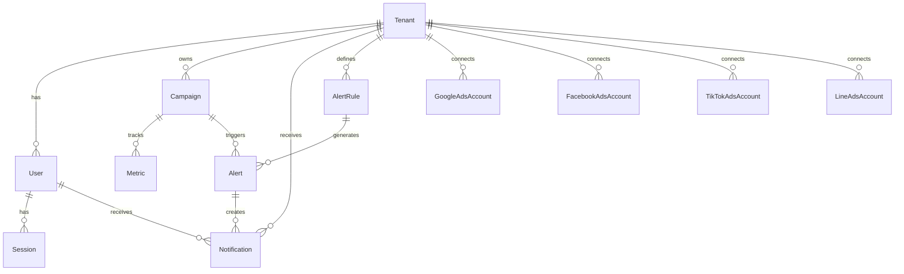

# Database Wiki: RGA AI Dashboard
> **Target Architecture for Sprint 4** | Last Updated: 2026-01-10

---

## 1. System Overview & Tech Stack 🛠️

### Technology Stack
| Component | Technology | Description |
|-----------|------------|-------------|
| **Database** | PostgreSQL | Relational database with JSONB support |
| **ORM** | Prisma | Type-safe database client |
| **Platform** | Supabase | Managed PostgreSQL + Auth + Real-time |
| **Backend** | NestJS | Node.js framework with TypeScript |

### Sprint 4 Scope Summary
จากเอกสารแผนงาน Sprint 4 มุ่งเน้น:
- **Dashboard Filter Enhancement** - ปรับปรุง UI (Filter, Date range, Download)
- **Performance Optimization** - Caching และ API rate handling
- **UAT & Feedback** - ทดสอบกับลูกค้าจริงและปรับโครงสร้าง data model
- **Notification System** - ระบบแจ้งเตือนที่ครบถ้วน
- **Multi-platform Ads** - รองรับ Google, Facebook, TikTok, LINE Ads

---

## 2. Schema Standards (Design Rules) 📏

### 2.1 Enums Strategy

> [!IMPORTANT]
> Sprint 4 ต้องเปลี่ยน String fields เป็น Prisma Enum เพื่อ Type-safety และ Data integrity

#### Required Enum Conversions

```prisma
// User Role Enum
enum UserRole {
  ADMIN
  MANAGER
  CLIENT
  VIEWER
}

// Campaign Status Enum
enum CampaignStatus {
  ACTIVE
  PAUSED
  DELETED
  PENDING
  COMPLETED
}

// Ad Platform Enum
enum AdPlatform {
  GOOGLE_ADS
  FACEBOOK
  TIKTOK
  LINE_ADS
  GOOGLE_ANALYTICS
}

// Notification Channel Enum
enum NotificationChannel {
  IN_APP
  EMAIL
  LINE
  SMS
}

// Alert Severity Enum
enum AlertSeverity {
  INFO
  WARNING
  CRITICAL
}

// Sync Status Enum
enum SyncStatus {
  PENDING
  STARTED
  IN_PROGRESS
  SUCCESS
  COMPLETED
  FAILED
}
```

#### Fields to Convert

| Model | Field | Current Type | Target Enum |
|-------|-------|--------------|-------------|
| `User` | `role` | `String` | `UserRole` |
| `Campaign` | `status` | `String` | `CampaignStatus` |
| `Campaign` | `platform` | `String` | `AdPlatform` |
| `SyncLog` | `platform` | `String` | `AdPlatform` |
| `SyncLog` | `status` | `String` | `SyncStatus` |
| `Alert` | `severity` | `String` | `AlertSeverity` |
| `AlertRule` | `severity` | `String` | `AlertSeverity` |

---

### 2.2 Naming Conventions

| Element | Convention | Example |
|---------|------------|---------|
| **Table/Model** | PascalCase | `User`, `Campaign`, `AlertRule` |
| **Field** | camelCase | `createdAt`, `lastSyncAt`, `tenantId` |
| **Foreign Key** | camelCase + "Id" | `userId`, `campaignId`, `tenantId` |
| **Enum** | PascalCase | `UserRole`, `CampaignStatus` |
| **Enum Values** | UPPER_SNAKE_CASE | `IN_PROGRESS`, `GOOGLE_ADS` |
| **Index** | Auto-generated by Prisma | `@@index([field])` |

---

## 3. Target Data Structure 🎯

### 3.1 Users & Security

#### Current Fields (Existing)
```prisma
model User {
  id        String   @id @default(cuid())
  email     String   @unique
  password  String
  name      String?
  role      String   @default("CLIENT")
  isActive  Boolean  @default(true)
  tenantId  String
  createdAt DateTime @default(now())
  updatedAt DateTime @updatedAt
}
```

#### Required New Fields for Sprint 4

```prisma
model User {
  // ... existing fields ...
  
  // 🔐 Security Enhancement (ตาม Requirement)
  lastLoginAt       DateTime?         // ครั้งสุดท้ายที่ login
  lastLoginIp       String?           // IP Address ของการ login
  failedLoginCount  Int       @default(0)  // จำนวนครั้งที่ login ผิด
  lockedUntil       DateTime?         // ล็อค account จนกว่า
  passwordChangedAt DateTime?         // ครั้งสุดท้ายที่เปลี่ยนรหัส
  twoFactorEnabled  Boolean   @default(false)
  
  // 🔔 Notification Preferences
  notificationPreferences Json?        // { "email": true, "inApp": true, "line": false }
  
  // 📱 UI Preferences
  timezone          String?   @default("Asia/Bangkok")
  language          String?   @default("th")
  
  // Relations
  notifications     Notification[]
}
```

> [!NOTE]
> **Requirement Reference:** "ความปลอดภัย & การเก็บ Log: เพราะเป็นข้อมูลที่มีค่าและส่วนตัว" (Line 43)

---

### 3.2 Notification System

#### New Table: `Notification`

```prisma
// ============================================
// Notification System - Sprint 4
// ============================================

model Notification {
  id          String               @id @default(cuid())
  tenantId    String
  userId      String
  
  // Content
  type        String               // ALERT, REPORT_READY, SYNC_COMPLETE, SYSTEM, CAMPAIGN_UPDATE
  title       String               // "Campaign Budget Alert"
  message     String               // "Campaign X has exceeded 90% budget"
  
  // Channel & Delivery
  channel     NotificationChannel  @default(IN_APP)
  priority    String               @default("NORMAL")  // LOW, NORMAL, HIGH, URGENT
  
  // 📦 Metadata for Frontend Actions (JSONB)
  metadata    Json?                // { "actionUrl": "/campaigns/123", "actionText": "View Campaign", "icon": "alert-circle" }
  
  // Status
  isRead      Boolean              @default(false)
  readAt      DateTime?
  isDismissed Boolean              @default(false)
  
  // Reference
  alertId     String?              // Link to Alert if notification from alert
  campaignId  String?              // Related campaign
  
  // Timestamps
  scheduledAt DateTime?            // For scheduled notifications
  sentAt      DateTime?
  createdAt   DateTime             @default(now())
  expiresAt   DateTime?            // Auto-dismiss after this time
  
  // Relations
  tenant      Tenant               @relation(fields: [tenantId], references: [id])
  user        User                 @relation(fields: [userId], references: [id])
  alert       Alert?               @relation(fields: [alertId], references: [id])
  
  @@index([userId, isRead])
  @@index([tenantId])
  @@index([createdAt])
  @@index([type])
}
```

#### Metadata JSONB Structure Examples

```json
// Alert Notification
{
  "actionUrl": "/dashboard/alerts",
  "actionText": "ดูรายละเอียด",
  "icon": "alert-triangle",
  "alertType": "LOW_ROAS",
  "campaignName": "Summer Sale 2026"
}

// Report Ready Notification
{
  "actionUrl": "/reports/download/abc123",
  "actionText": "ดาวน์โหลดรายงาน",
  "icon": "file-text",
  "reportType": "MONTHLY_PERFORMANCE",
  "format": "PDF"
}

// Sync Complete Notification
{
  "actionUrl": "/settings/integrations",
  "actionText": "ดูผลการ Sync",
  "icon": "refresh-cw",
  "platform": "GOOGLE_ADS",
  "recordsSynced": 150
}
```

> [!TIP]
> **Requirement Reference:** "แจ้งเตือน (Alert/Notification): ถ้า metric ใดๆ เกินหรือต่ำกว่าค่าที่ตั้งไว้" (Line 22)

---

### 3.3 Ads Integration Token Storage

#### Current Structure (Existing)
แต่ละ Platform มี Model แยก:
- `GoogleAdsAccount` ✅
- `FacebookAdsAccount` ✅
- `TikTokAdsAccount` ✅
- `LineAdsAccount` ✅

#### Enhanced Token Management Table

```prisma
// ============================================
// Unified Token Management - Sprint 4
// ============================================

model PlatformToken {
  id              String      @id @default(cuid())
  tenantId        String
  platform        AdPlatform  // GOOGLE_ADS, FACEBOOK, TIKTOK, LINE_ADS
  accountId       String      // Platform-specific account ID
  
  // 🔐 Token Storage (Encrypted)
  accessToken     String      @db.Text
  refreshToken    String?     @db.Text
  tokenType       String?     @default("Bearer")
  tokenScope      String?     // OAuth scopes granted
  
  // Token Lifecycle
  expiresAt       DateTime?
  refreshedAt     DateTime?
  lastUsedAt      DateTime?
  
  // Token Health
  isValid         Boolean     @default(true)
  errorMessage    String?
  refreshAttempts Int         @default(0)
  
  // Audit
  createdAt       DateTime    @default(now())
  updatedAt       DateTime    @updatedAt
  createdBy       String?     // User who connected
  
  tenant          Tenant      @relation(fields: [tenantId], references: [id])
  
  @@unique([tenantId, platform, accountId])
  @@index([platform])
  @@index([isValid])
}
```

#### Platform-Specific Token Requirements

| Platform | Required Fields | Optional Fields | Refresh Strategy |
|----------|----------------|-----------------|------------------|
| **Google Ads** | `accessToken`, `refreshToken`, `customerId` | `developerToken` | Auto-refresh via refresh_token |
| **Facebook** | `accessToken`, `accountId` | `pageAccessToken` | Long-lived token (60 days) |
| **TikTok** | `accessToken`, `refreshToken`, `advertiserId` | - | Refresh every 24 hours |
| **LINE Ads** | `accessToken`, `channelId` | `channelSecret` | Manual reconnect |

---

## 4. Migration Notes 📋

### 4.1 Gap Analysis: Existing vs Required

#### ✅ Already Exists in Current Schema

| Feature | Model | Status |
|---------|-------|--------|
| Multi-tenant | `Tenant`, `tenantId` FK | ✅ Complete |
| User Authentication | `User`, `Session` | ✅ Complete |
| Campaign Tracking | `Campaign`, `Metric` | ✅ Complete |
| Google Ads | `GoogleAdsAccount` | ✅ Complete |
| Facebook Ads | `FacebookAdsAccount` | ✅ Complete |
| TikTok Ads | `TikTokAdsAccount` | ✅ Complete |
| LINE Ads | `LineAdsAccount` | ✅ Complete |
| Alert Rules | `AlertRule` | ✅ Complete |
| Alert Instances | `Alert` | ✅ Complete |
| Sync Logging | `SyncLog` | ✅ Complete |
| Audit Logging | `AuditLog` | ✅ Complete |
| Web Analytics | `WebAnalyticsDaily` | ✅ Complete |

#### 🔨 Must Create for Sprint 4

| Feature | Model/Change | Priority | Description |
|---------|--------------|----------|-------------|
| **Notification System** | `Notification` (NEW) | 🔴 High | ตาราง Notification สำหรับแจ้งเตือน user |
| **Security Fields** | `User` (MODIFY) | 🔴 High | เพิ่ม `lastLoginAt`, `lastLoginIp`, etc. |
| **Enums** | All Models | 🟡 Medium | แปลง String → Enum |
| **Token Management** | `PlatformToken` (NEW) | 🟡 Medium | Unified token storage |
| **Notification Preferences** | `User` (MODIFY) | 🟢 Low | เพิ่ม `notificationPreferences` JSON |
| **Alert-Notification Link** | `Alert` (MODIFY) | 🟢 Low | เพิ่ม relation to `Notification` |

---

### 4.2 Migration Checklist

```markdown
- [ ] Create Enums (UserRole, CampaignStatus, AdPlatform, etc.)
- [ ] Migrate User.role String → UserRole Enum
- [ ] Migrate Campaign.status String → CampaignStatus Enum
- [ ] Add User security fields (lastLoginAt, lastLoginIp, etc.)
- [ ] Create Notification table
- [ ] Add Notification relation to User
- [ ] Add Notification relation to Alert
- [ ] Create PlatformToken table (optional: consolidate tokens)
- [ ] Update AlertRule.severity/Alert.severity → AlertSeverity Enum
- [ ] Add Tenant relation to Notification
```

---

### 4.3 Schema Version History

| Version | Date | Sprint | Changes |
|---------|------|--------|---------|
| v1.0 | 2025-11 | Sprint 1 | Initial: User, Tenant, Campaign, Metric |
| v1.1 | 2025-11 | Sprint 2 | Added: GoogleAdsAccount, FacebookAdsAccount |
| v1.2 | 2025-12 | Sprint 3 | Added: Alert, AlertRule, SyncLog, TikTok/LINE |
| **v2.0** | **2026-01** | **Sprint 4** | **Target: Notification, Enums, Security** |

---

## Appendix: ERD Overview



---

> **Document Owner:** Lead Data Architect  
> **Review Status:** Draft for Sprint 4 Planning
